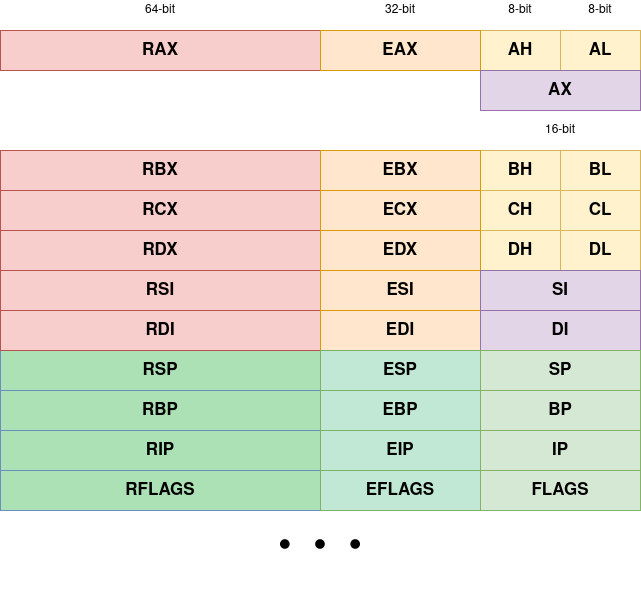

----
marp: true
theme: uncover
title: Introduction to Reverse Engineering
paginate: true
footer: Phish 'n' Chips Team, CC BY 4.0
style: |
    div.twocolumn {
        column-count: 2;
    }
_paginate: false
_class: invert
----

# <!--fit-->Introduction to Reverse Engineering

Phish 'n' Chips Team

---

# Outline

- What is Reverse Engineering?
- Interpreted vs. Compiled Languages
- Executable file formats
- Memory regions
- X86 crash course

---

# <!--fit--> What is Reverse Engineering? 

Reverse engineering is the process of determining how a product is constructed by analyzing it, _without having access to the original blueprints_

---

# <!--fit--> Reverse Engineering an Executable

In the computer science domain, reverse engineering is reconstructing an high level representation _(source code)_ of a program from its optimized form _(assembly)_

---

# <!--fit--> From Source Code to Executable

Source code is not directly executed by the CPU. It has to be _transformed_ first

---

# Compiled Languages

Source code is transformed to an executable **run directly** by the target operating system by a _compiler_. This means the program is written in some _assembly_ language

A few examples:

- C / C++
- Rust

---

# Interpreted Languages

Source code is transformed into an intermediate representation executed by an **interpreter**. This representation is usually called _bytecode_

A few examples:

- Python
- Ruby

---

# Executable Formats

Each operating system executes programs in different ways. A program has to be "packaged" for a specific OS before being executed

The way a program is prepared is called **executable format**

---

# <!--fit--> Windows: Portable Executable (PE)


---

# <!--fit--> Linux: Executable and Linkable Format (ELF)


---

# <!--fit--> MacOS: Mach Object File Format (Mach-O)


---

# Memory regions

An executable usually has three memory regions.

<div class=twocolumn>
<br>
The <b>program header</b>, the <b>heap</b> and the <b>stack</b>.

<br><br>

```text
| Program header| 0x00000000
|---------------| 
|     Heap      | |
|---------------| V
|     Stack     |
|---------------| 0xFFFFFFFF
```
</div>

---

# The Program Header

The program header contains various information on how the OS has to load the executable. The locations of different memory segments are defined here

It includes the specification of the _base address_, the _entrypoint_, the _import table_ and more

---

# The Heap

The heap is where data structures generated **at runtime** are stored. This memory region expands and shrinks as the developer requests/releases memory

---

# The Stack

The stack is a _LIFO (last-in first-out)_ memory region. It's used by the program to store runtime information and it's crucial for function invocations

---

# <!--fit--> Pushing and Popping on the Stack

The data on the stack may be handled with two operations: _push_ and _pop_

<div class=twocolumn>

<b> Push </b>

```text
Pushing A, then B

|     Empty     |
|---------------| 
|       B       |
|---------------|
|       A       |
|---------------|
```

<b> Pop </b>

```text
To get A, we must pop B first

|     Empty     |
|---------------| 
|     Empty     |
|---------------|
|       A       |
|---------------|
```

</div>

---

# Stack frame

A stack frame contains information about the active function in the program. It stores the _arguments_, _local variables_ and saved registers to keep track of the execution

---

# Structure of the stack frame

```text
|---------------|
|     arg 2     | Second argument
|---------------| 
|     arg 1     | First argument
|---------------| 
|     var 1     | Local variable
|---------------|
|      EBP      | Saved base pointer (optional)
|---------------|
|      RET      | Saved return address
|---------------|

```
---

# The `x86` Instruction Set

The `x86` instruction set is one of the most used CPU architectures and it belongs to the _CISC (Complex Instruction Set Computer)_ family

---

# <!--fit--> Some history of the `x86` family

The `x86` is pretty old. It started as a 16-bit architecture with Intel shipping the `8086` CPU

Later it evolved to support 32-bit and, finally, 64-bit instructions

---

# <!--fit--> The Syntax War:tm:: AT&T vs Intel

The instructions may be disassembled following two different syntax: **AT&T** (the wrong one) and **Intel**

---

# Syntax Examples

The main difference is that the AT&T syntax puts the source operand *first* while the Intel one puts the destination operand *first*

<div class=twocolumn>

<b> AT&T</b>

```text
operation source, destination

add       $0x8  , %rsp
```

<b> Intel </b>

```text
operation destination, source

add       rsp        , 0x8
```

</div>

---

# Anatomy of an instruction

An instruction is composed by an _operation_ and zero or more _operands_

We refer to operations through _mnemonics_

The operands may be numbers, registers or memory locations

---

### Registers

<div class=twocolumn>



`RSP`, `RBP`, `RIP` and `RFLAGS` are specialized registers

The `x86` instruction set has several more registers!

---

# Instruction Formats

Since `x86` is a CISC architecture, it has instruction variations that permit operations between:

- Register to Register
- Register to Memory
- Memory to Register
- Immediate to Register
- Immediate to Memory

---

# Addressing Modes

An addressing mode provides a way to _calculate an address_ the instruction has to operate on

---

# Addressing Examples

- Register  `mov rax, [rax]`
- Register + Offset `mov rax, [rax + 0x10]`

---

# Common operations

`x86` has a huge set of instructions

The instructions range from moving values from a register to another to calculating a round of the AES keyschedule!

---

# Some examples

- Add two registers `add rax, rbx`
- Move a register into another `mov rax, rbx`
- Move the _memory contents_ pointed by a register into a register `mov rax, [rbx]`
- Do nothing `nop`
- Compare two values `cmp rax, rbx`
- Jump if result is zero `jz 0xb00bb00b`

---

#  Calling Conventions

A calling convention is a scheme that defines how functions receive their parameters and return their result to callers

Different _instruction set architectures (ISA)_ use different calling conventions

---

# <!--fit--> `x86` Calling Convention (32-bit)

Parameters are passed **on the stack** in reverse order. The result is stored in register `EAX`.

---

# <!--fit--> `x86_64` Calling Convention (64-bit)

Parameters are passed in **registers** and, if more are needed, on the stack. The result is stored in register `RAX`

The order in which registers are read is:

`RDI, RSI, RDX, RCX, R8, R9`

---

<!--
_paginate: false
_class: invert
-->

# That's it!

Questions?

---

<!--
_paginate: false
_class: invert
-->

These slides are licensed under  Attribution 4.0 International (CC BY 4.0)


Modifications by:

* 2020: Giulio De Pasquale (@peperunas)